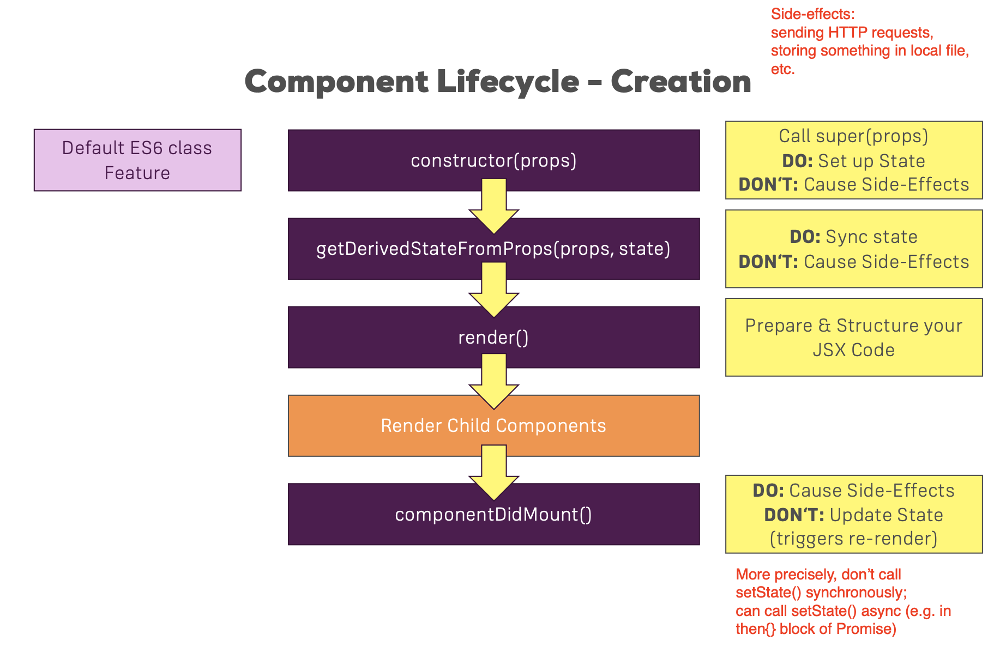
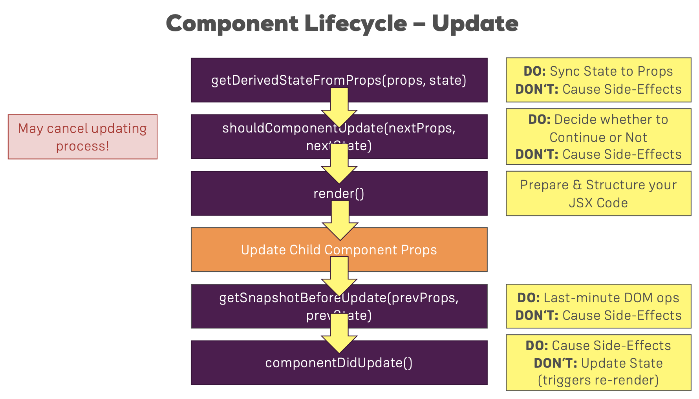

# React + HTTP requests  

### Tools  

* [JSON Placeholder - Fake online REST API for testing and prototyping](https://jsonplaceholder.typicode.com)  
* [AXIOS - Promise based HTTP client for the browser and node.js](https://github.com/axios/axios)  

### In which part of component lifecycle can we make HTTP requests?  

The HTTP request is one of the side effects.  

During mount lifecycle:  
  

During update lifecycle:  
  